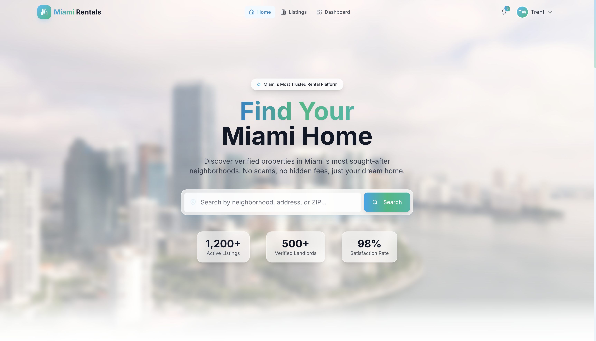
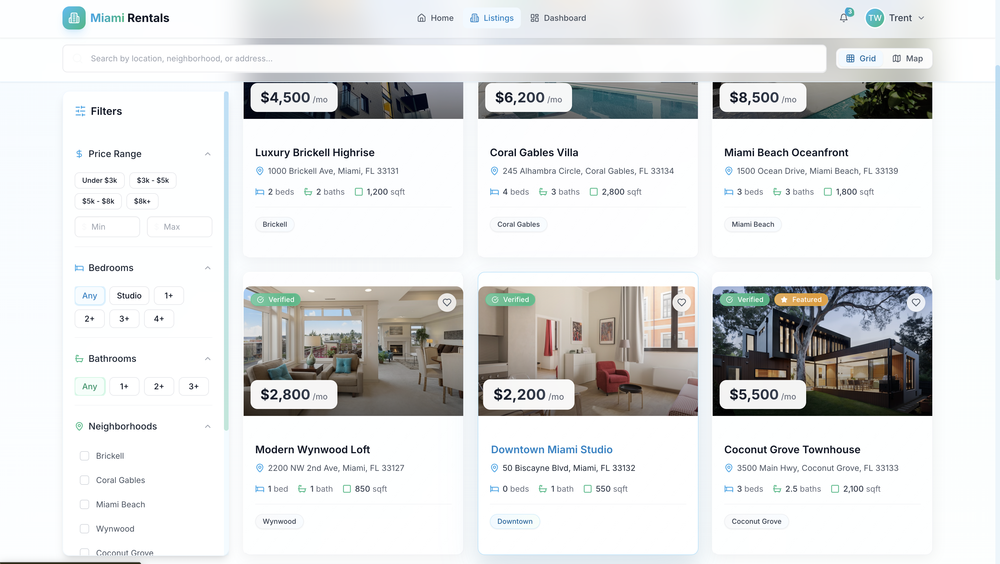
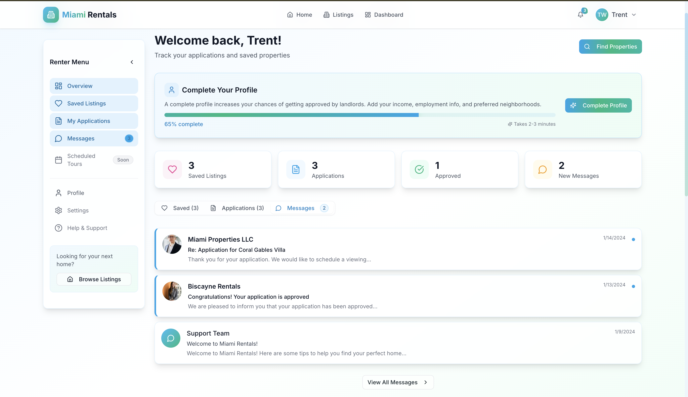

# Open Rentals

A self-hostable rental listing platform. Ships with landlord identity verification, PostGIS-powered geo-search, and a full renter application flow. Fork it and deploy it for your city.



## Stack

**Backend** — FastAPI, PostgreSQL + PostGIS, SQLAlchemy 2.0 (async), Alembic, Redis
**Frontend** — Next.js 14 (App Router), TypeScript, Tailwind CSS, Radix UI, Mapbox GL
**Infrastructure** — Docker, Cloudinary (images), Stripe (payments)

## Running locally

```bash
cp .env.example .env
cp backend/.env.example backend/.env
cp frontend/.env.example frontend/.env.local
# Fill in the required keys below, then:

docker-compose up -d

# Seed demo data (first run only)
docker-compose exec backend python seed.py
```

- Frontend: http://localhost:3000
- API + docs: http://localhost:8000/docs

## Features

- Landlord identity verification with admin approval before listings go live
- Property listings with PostGIS radius search and Mapbox map view
- JWT auth with access + refresh tokens, role-based: renter / landlord / admin
- Full rental application flow with status tracking per listing
- Separate dashboards for renters and landlords
- Email notifications for applications and verification status

## Screenshots

| Listings | Listing Detail |
|----------|---------------|
|  |  |

| Renter Dashboard |
|-----------------|
|  |

## Project structure

```
backend/
  app/
    api/routes/     # auth, properties, applications, users
    core/           # config, security utilities
    models/         # SQLAlchemy ORM models
    schemas/        # Pydantic request/response schemas
    services/       # email, media upload
    db/             # async engine, session
  alembic/          # migrations

frontend/
  src/
    app/            # Next.js pages (App Router)
    components/     # UI, layout, property cards, dashboard
    lib/            # API client, auth context
```

## API keys

### Required
| Key | Where | Notes |
|-----|-------|-------|
| `SECRET_KEY` | `backend/.env` | Any long random string — used for JWT signing |
| `DATABASE_URL` | `backend/.env` | Set automatically by docker-compose |

### Required for the map view
| Key | Where | How to get |
|-----|-------|-----------|
| `NEXT_PUBLIC_MAPBOX_TOKEN` | `frontend/.env.local` | [account.mapbox.com](https://account.mapbox.com/access-tokens/) — free tier is sufficient |

### Optional (features degrade gracefully without them)
| Key | Feature | Where to get |
|-----|---------|-------------|
| `CLOUDINARY_CLOUD_NAME` / `CLOUDINARY_API_KEY` / `CLOUDINARY_API_SECRET` | Property photo uploads | [cloudinary.com](https://cloudinary.com) — free tier |
| `SMTP_HOST` / `SMTP_USER` / `SMTP_PASSWORD` | Email notifications (verification, password reset) | Any SMTP provider (Gmail, SendGrid, Resend, etc.) |
| `GOOGLE_MAPS_API_KEY` | Address autocomplete | [Google Cloud Console](https://console.cloud.google.com) — Maps JavaScript API |

The app runs without Cloudinary, SMTP, and Google Maps — those features are simply disabled or fall back gracefully.
